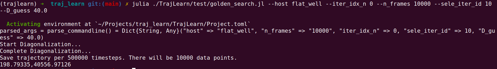
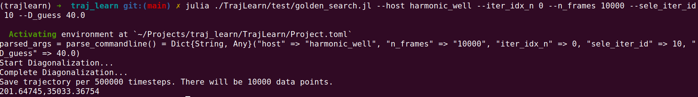
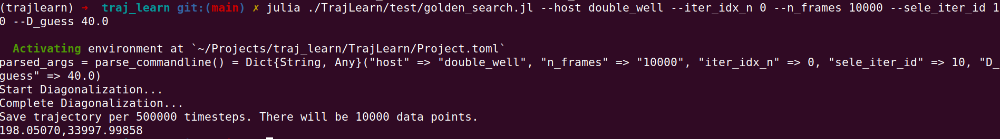

# traj_learn

## conda environment
```
conda create -n trajlearn python=3.8 
matploltib=3.6.2 h5py=3.7.0
```

```
conda activate trajlearn
conda install -c conda-forge matplotlib
conda install -c anaconda h5py
```

## Langevin Simulation
### Simulation
- Step-shape potential
```
julia ./TrajLearn/test/step_langevin.jl
```
- Harmonic potential
```
julia ./TrajLearn/test/harmonic_langevin.jl
```
- Double-well potential
```
julia ./TrajLearn/test/doublewell_langevin.jl
```
### Plots
```
python scripts/plot_trajectory.py
```

### Extract Trajectory
```
python scripts/extract_traj.py
```

## Learn $p_{\mathrm{eq}}$
- Step-shape potential
```
julia ./TrajLearn/test/learn_peq.jl --host flat_well --iter_idx_n 0 --n_frames 10000 --max_n_iteration 10 --D_guess 40
```
- Harmonic potential
```
julia ./TrajLearn/test/learn_peq.jl --host harmonic_well --iter_idx_n 0 --n_frames 10000 --max_n_iteration 10 --D_guess 40
```
- Double-well potential
```
julia ./TrajLearn/test/learn_peq.jl --host double_well --iter_idx_n 0 --n_frames 10000 --max_n_iteration 10 --D_guess 40
```
### Plots
```
python scripts/plot_PMF.py
```

## Golden Search $D$
```
julia ./TrajLearn/test/golden_search.jl --host flat_well --iter_idx_n 0 --n_frames 10000 --sele_iter_id 10 --D_guess 40.0
julia ./TrajLearn/test/golden_search.jl --host harmonic_well --iter_idx_n 0 --n_frames 10000 --sele_iter_id 10 --D_guess 40.0
julia ./TrajLearn/test/golden_search.jl --host double_well --iter_idx_n 0 --n_frames 10000 --sele_iter_id 10 --D_guess 40.0
```


